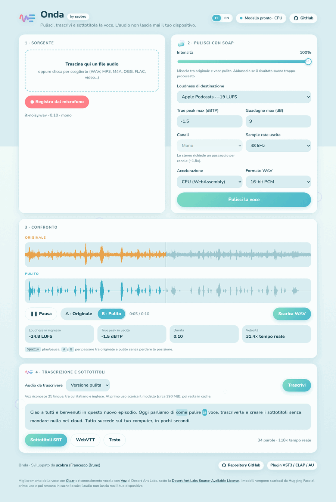
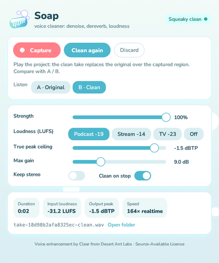
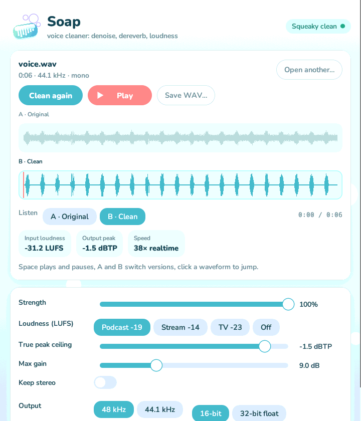

<p align="center"></p>

<h1 align="center">Onda</h1>

<p align="center"><b>Voice, text and subtitles</b>: clean up, transcribe and subtitle recordings, entirely on your device.</p>

<p align="center">
  
  
  
</p>

Onda is a suite of voice tools built on the small on-device models from
[Desert Ant Labs](https://desertant.com). Nothing is uploaded: the models run in
the browser or in the app, and are downloaded once from Hugging Face.

| Tool | Model | What it does | Where |
|---|---|---|---|
|  **Soap** | [Clear](https://desertant.com/models/clear/) | Denoise, dereverb and loudness normalization | Web, desktop app, VST3/AU/CLAP plugin |
|  **Transcript & subtitles** | [Voz](https://desertant.com/models/voz/) | Transcript with word timestamps in 25 languages, SRT/VTT/TXT export | Web |

## Soap: voice cleanup

Soap is built on Clear, a fine-tuned DeepFilterNet 3. It comes in three forms:

| | `plugin/` | `plugin/app/` | `web/` |
|---|---|---|---|
| What it is | Audio plugin: **VST3, AU, CLAP** | **Desktop app** | Static browser app |
| Platforms | **Windows x64**, **macOS Apple Silicon (14+)**, Linux x64 | **Windows x64**, **macOS Apple Silicon (14+)**, Linux x64 | Any modern browser |
| Runtime | Native Clear core: LiteRT on Windows/Linux, Core ML on macOS | Same native core as the plugin | WebAssembly + LiteRT.js (CPU) or WebGPU |
| Workflow | Capture a track region, clean it, play back on the timeline | Open a file, clean it, compare A/B, save WAV | Load or record a file, clean it, compare, export WAV |

Clear processes whole takes, not a real-time stream: loudness normalization
measures the integrated LUFS of the whole take, and even its streaming mode
works in 2-second windows. So the plugin works "offline", Melodyne style.

### Audio plugin

#### Download and install

Every tag `vX.Y.Z` publishes a GitHub Release with the plugin and app
packages below (every push also leaves them as Actions artifacts):

| Package | Contents | Install |
|---|---|---|
| `soap-…-windows.zip` | VST3, CLAP | `install.cmd` → `C:\Program Files\Common Files\{VST3,CLAP}` (`install.ps1 -User` for the current user only) |
| `soap-…-macos.zip` | AU, VST3, CLAP | `./install.sh` → `~/Library/Audio/Plug-Ins/{Components,VST3,CLAP}` |
| `soap-…-linux.zip` | VST3, CLAP | `./install.sh` → `~/.vst3`, `~/.clap` |

Each package already contains the Clear native core. The model weights are
downloaded from Hugging Face the first time you press Clean and then stay
cached.

> On Windows the VST3 loads the CLAP from the CLAP folder: the script installs both.
> On macOS the packages carry an ad-hoc signature. That's fine on your own Mac
> (the script removes the quarantine flag), but distributing to others without
> warnings needs a Developer ID signature and notarization.

#### Usage

1. Put Soap on the voice track.
2. Press **Capture**, then play the section you want to clean in your DAW.
3. When the transport stops, the take is cleaned in the background (turn off *Clean when capture stops* to do it by hand).
4. Play the project: over the captured region the plugin replaces the input with the clean version. **A · Original / B · Clean** switches between them instantly.
5. If you change strength, loudness, or other settings, press **Clean again**: it re-renders from the saved original, without capturing again.

Details:

- Capture follows the timeline position, so it handles loops, jumps, and several passes over the same region.
- The project saves only a reference to the take. The audio (original and clean, 32-bit float WAV) lives in the `soap-voice/takes` folder under your user data directory. **Open folder** takes you there, so you can also drag the clean file straight into the DAW.
- If the project's sample rate changes, the take is re-rendered automatically from the original.
- The audio thread never allocates or blocks. Capture goes through lock-free ring buffers, and download, inference, and disk I/O run on a worker thread.

#### How it's built

- `plugin/src`: the plugin in Rust with [nih-plug](https://github.com/robbert-vdh/nih-plug) (CLAP export) and a custom egui GUI (`theme.rs`: palette, logo painted as vectors, bubble sliders, foam animation while cleaning). Clear is loaded at runtime through its C ABI (`dal_*`), the same one the official Node SDK uses.
- `plugin/wrapper`: [clap-wrapper](https://github.com/free-audio/clap-wrapper) turns the CLAP into **VST3** and **AUv2**. On macOS the CLAP is embedded in the VST3 and AU bundles, and the Clear core in `Contents/Resources/native` of the CLAP.
- Clear core:
  - macOS and Linux: prebuilt from the `@desert-ant-labs/clear` npm package (`scripts/install-native.sh`).
  - Windows: Desert Ant Labs doesn't publish it, so CI builds it from the source of [desert-ant-core](https://github.com/Desert-Ant-Labs/desert-ant-core) (`scripts/build-clear-windows.ps1`: Swift 6.2 + LiteRT). The DLLs sit next to the `.clap` and are loaded from that folder only.

#### Local build

Prerequisites: Rust stable, CMake 3.21+, and a C++ compiler (Xcode on macOS, Visual
Studio on Windows). On Linux you also need `libx11-xcb-dev libxcursor-dev libgl-dev
libxcb-icccm4-dev libxcb-dri2-0-dev libasound2-dev libjack-jackd2-dev`.

```bash
cd plugin
./scripts/package-unix.sh            # macOS / Linux → target/dist/*.zip
```

```powershell
cd plugin
./scripts/build-clear-windows.ps1    # Windows, from a VS developer prompt with Swift 6.2
./scripts/package-windows.ps1        # → target/dist/*.zip
```

To try the model outside a DAW:
`SOAP_NATIVE_DIR=<clear-core-folder> cargo run --release --example enhance_wav -- noisy.wav clean.wav`.

#### Tests and CI

`.github/workflows/build.yml` runs on every push:

- `cargo clippy -D warnings` and unit tests: FFI payloads (same format as the SDK's `codec.js`), timeline capture, playback, WAV, resampling.
- A build and package of the plugin and the desktop app for Windows, macOS, and Linux.
- A **smoke test with the real model** on all three platforms: a noisy file cleaned through the native core, checking duration and that the output has no NaN or infinity, then again through each packaged app (`--clean`).
- **`auval`** on the macOS Audio Unit.
- A **browser E2E test** (Playwright + Chromium) of the web app with the real model.

The Linux VST3 passes all 47 tests of Steinberg's `validator`, and the CLAP passes
`clap-validator` except for the `state-reproducibility-*` tests, which nih-plug's own
examples fail too.

### Desktop app (`plugin/app`)

The same cleaning without a DAW: drop a recording on the window (WAV, AIFF,
FLAC, MP3, M4A/AAC, ALAC, Ogg Vorbis), Soap washes it right away, then you
compare the original (A) and clean (B) versions on the same timeline and save
a WAV (16-bit or 32-bit float, 48 or 44.1 kHz).

| Package | Contents | Install |
|---|---|---|
| `soap-app-…-windows.zip` | `Soap\Soap.exe` with the Clear DLLs | `install.cmd` → `%LOCALAPPDATA%\Programs\Soap` + Start menu, or run `Soap.exe` in place |
| `soap-app-…-macos.zip` | `Soap.app` | Drag it to Applications |
| `soap-app-…-linux.zip` | `Soap/soap` with the Clear core | `./install.sh` → applications menu + `soap` command |

- It's a native Rust app (eframe/egui with the plugin's theme, Symphonia for
  decoding, cpal for playback) that loads the same Clear core as the plugin,
  from `Soap.app/Contents/Resources/native`, beside `Soap.exe`, or `native/`
  beside `soap`.
- Space plays and pauses, `A`/`B` switch versions without losing the
  position, and clicking a waveform jumps there. Settings are remembered.
- `soap --clean input.mp3 output.wav [--loudness podcast|stream|tv|off]
  [--strength 0-100] [--stereo] [--rate 44100] [--float]` runs the same
  pipeline without a window. CI uses it to test every package with the real
  model.
- The builds aren't notarized or code-signed: macOS asks you to allow the app
  once in System Settings → Privacy & Security, and Windows SmartScreen shows
  "More info → Run anyway".

Build it with `cargo run --release -p soap-app` (it needs the Clear core:
`SOAP_NATIVE_DIR`, as for `enhance_wav`), or package it with
`./scripts/package-app-unix.sh` / `./scripts/package-app-windows.ps1`.

## Onda on the web (`web/`)

**Live demo:** [soap-blond.vercel.app](https://soap-blond.vercel.app)

One page runs the whole flow: load or record a file, clean it with Soap, compare,
then transcribe the clean (or original) version and export subtitles.

```bash
cd web
npm install
npm run dev      # http://localhost:5173
npm run build    # static site in web/dist/
```

- Load any file the browser can decode, or record from the mic with the browser's DSP turned off
- Settings: strength, LUFS target (Podcast −19, Streaming −14, EBU R128 −23, custom, off), true-peak ceiling, max gain, mono or stereo, 48/44.1 kHz output, CPU or WebGPU
- Before/after comparison with waveforms, click-to-seek, and A/B switching (`A`/`B` keys) that keeps the playback position
- Export WAV as 16-bit PCM or 32-bit float
- **Transcript** with Voz: every word is clickable and jumps the player there, and the word being spoken is highlighted during playback
- **Subtitles**: SRT and WebVTT cues of at most two 42-character lines and 6 seconds, split at pauses and sentence ends (`src/subtitles.ts`, tested with `npm test`), plus plain text in paragraphs

The weights (`desert-ant-labs/clear` on Hugging Face) are downloaded on first use
and cached by the browser (`VITE_CLEAR_MODEL_BASE_URL` serves them yourself). The
LiteRT.js runtime is served from your own origin. For the multi-threaded runtime,
the host must send `Cross-Origin-Opener-Policy: same-origin` and
`Cross-Origin-Embedder-Policy: credentialless` headers (the Vite servers already do).

Voz runs on WebGPU (with the decode step on WebNN where the browser has it) and
falls back to the CPU on a machine without a usable GPU. Its bundle is about
390 MB, downloaded on the first transcription and kept in the browser's cache
(`VITE_VOZ_MODEL_BASE_URL` serves it yourself). ONNX Runtime Web is bundled by
Vite and loaded only when you transcribe. Voz doesn't detect the language
itself, and its accuracy varies by language (see the
[model card](https://huggingface.co/desert-ant-labs/voz)).

CI runs the page in headless Chromium with the real models: a noisy file through
Clear, then a synthetic spoken sentence (espeak-ng) cleaned and transcribed by Voz,
checking the words and the SRT.

## Licenses

- **Clear** and **Voz** (models, SDKs, native core) are under the [Desert Ant Labs Source-Available License](https://license.desertant.com/1.0). It's not an OSI open-source license:
  - Free up to 100,000 monthly active devices per platform, per model. Above that you need a commercial license.
  - Desert Ant Labs must be credited (the web UI and the plugin do this).
  - You may not use the model or its outputs to train competing models.
  - The SDK sends Desert Ant Labs an active-device count. It never sends the audio.
- **nih-plug** is ISC and **clap-wrapper** is MIT. The app uses **eframe/egui**, **Symphonia**, **cpal** and **rfd** (MIT/Apache 2.0 or MPL 2.0 for Symphonia). The **VST3 SDK** (MIT since 2025) and **AudioUnitSDK** (Apache 2.0) are fetched at build time. There are no GPL components: VST3 comes from clap-wrapper, not from nih-plug's GPLv3 export.
- The **Nunito** font (plugin and web app) is under the SIL Open Font License 1.1 (`plugin/assets/fonts/OFL.txt`).
- The Onda and Soap logos and icons (`assets/`, `web/public/`, `plugin/app/assets/`) are part of this project.
- VST is a trademark of Steinberg Media Technologies GmbH.
